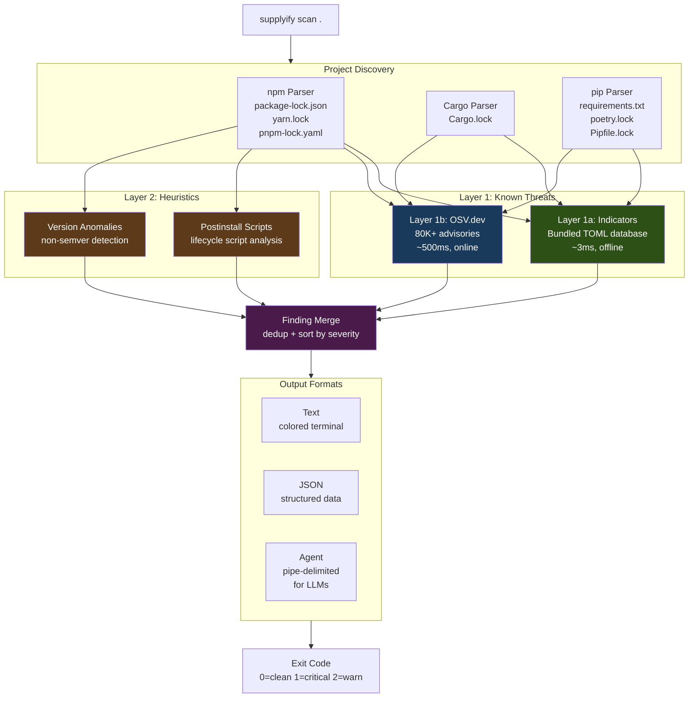
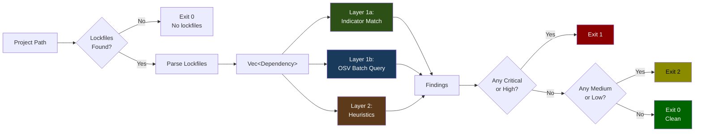
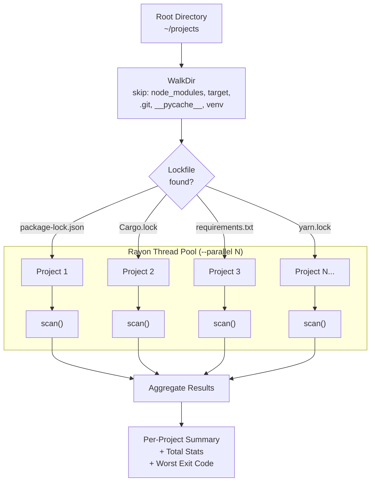
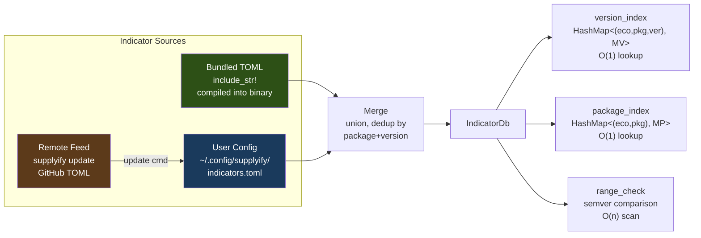
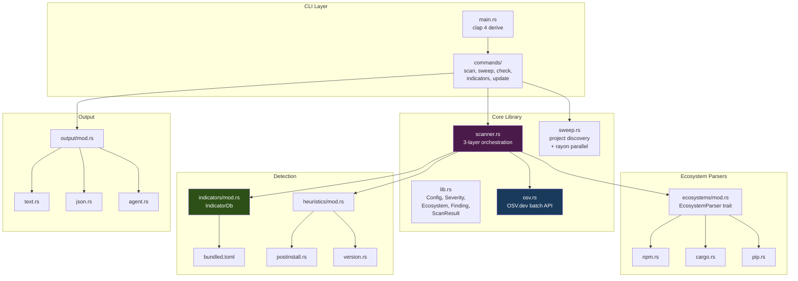
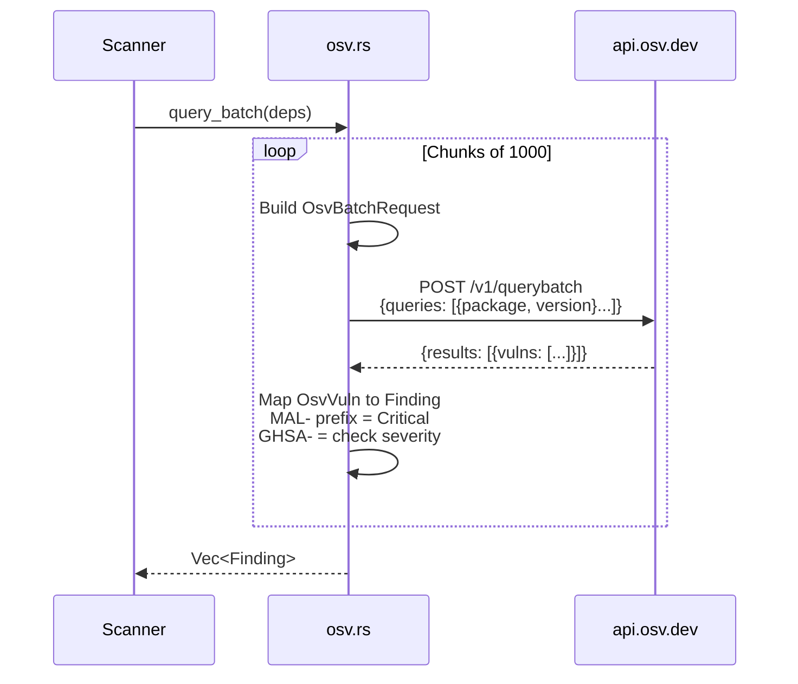
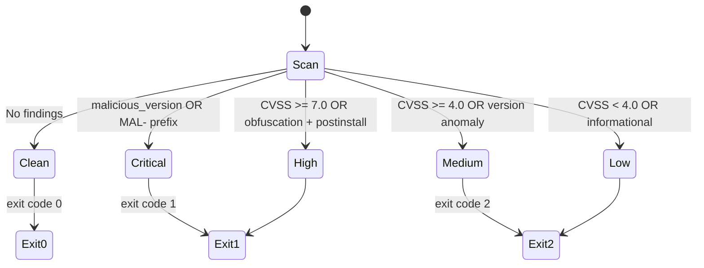

# supplyify Architecture Diagrams

## System Architecture

High-level view of how supplyify's detection layers work together.

## Scan Data Flow

Step-by-step flow of a single `supplyify scan .` invocation.

## Sweep Mode

How `supplyify sweep ~/projects` discovers and scans multiple projects in parallel.

## Indicator Database

How indicators are loaded, merged, and indexed for fast lookups.

## Module Structure

## OSV.dev Integration

Sequence diagram for the OSV batch query flow.

## Finding Severity Classification

---

*Diagrams render natively on GitHub, in VS Code (with Mermaid Preview extension), and at [mermaid.live](https://mermaid.live).*
